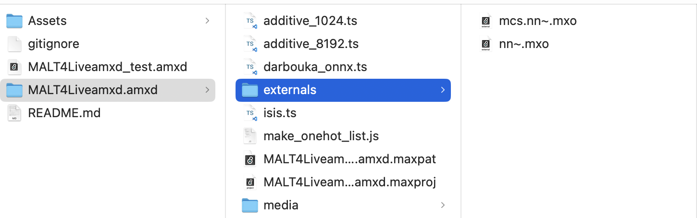
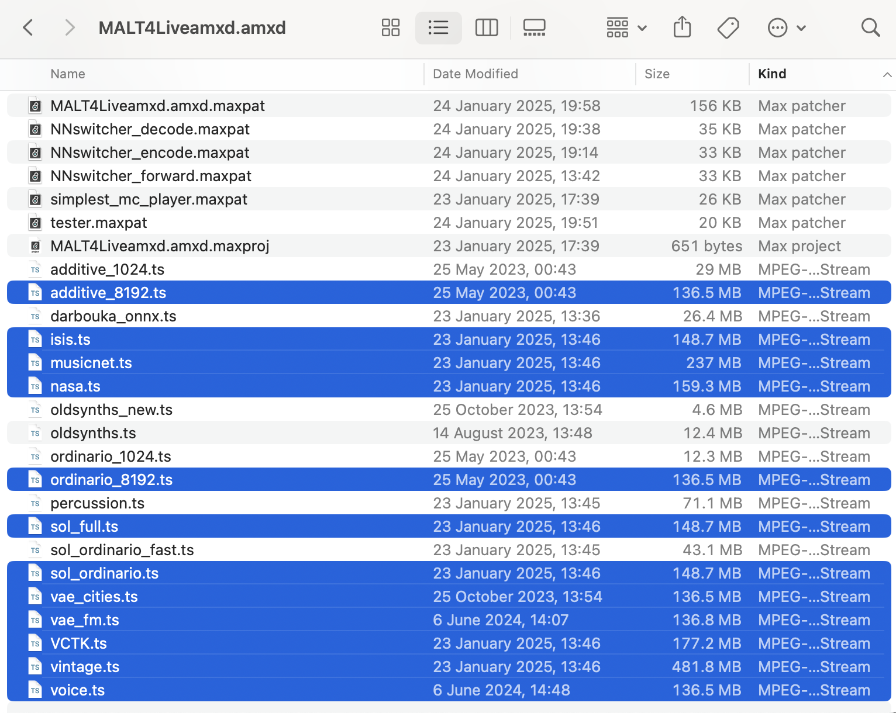
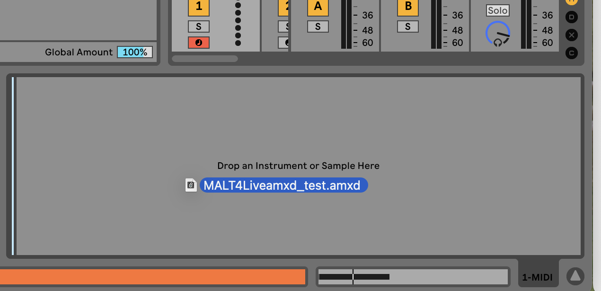
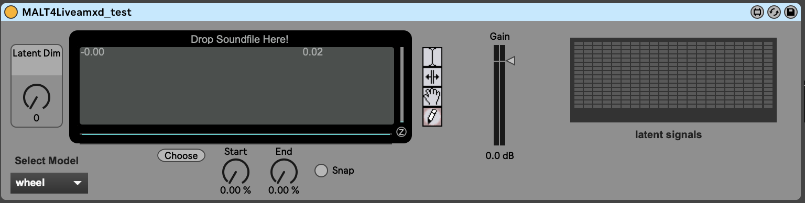
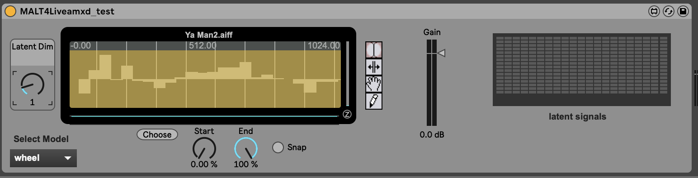

# MALT-Max4Live-Device
 A Max4Live Device facilitating the use of latent audio manipulation in popular production tool Ableton Live [You can use a free trial of Live available here](https://www.ableton.com/en/trial/)

 demo video ()[]

## Setup:

### IMPORTANT: ADD the following files before opening

Due to GitHub regulations, the following files can't be stored in this repo. You will have to manually download and add them yourself:
#### [The NN~ External](https://github.com/acids-ircam/nn_tilde) (also available within Max externals manager)

Add the nn~ and mcsnn~ files to the `externals` folder as in this screenshot:

- [RAVE Models](https://acids-ircam.github.io/rave_models_download):
  - additive_8192.ts
  - isis.ts
  - musicnet.ts
  - nasa.ts
  - sol_full.ts
  - sol_ordinario_fast.ts
  - sol_ordinario.ts
  - VCTK.ts
  - vintage.ts
  - voice.ts
- [VSChaosModels](https://www.dropbox.com/scl/fo/6th53cqxmpf106jj84usk/AFd9AYaZ3fuYBsGHtzPgWAg?rlkey=auvetbzxc89kv1uzvl7u3kc4n&e=1&dl=0):
  - vae_cities.ts
  - vae_fm.ts
  - ordinario_8192.ts

Be sure to add these to the `MALT4Liveamxd.amxd/` **folder** of the project, it should look like this: 

### Then Drag and drop into Ableton (and have fun)

## Use:

To use the tool, first drag an audio file into the window.

Now that a sample has been loaded into the window you should explore the latent dimensions. In fact, they won't load in the window until the `Latent Dim` dial has been moved.

### Playing Sound
Play sound by sending midi to your channel. *The meters on the right-hand side are for debugging, to ensure that your model is encoding and decoding properly, and that playback works as intended*
### Manipulating Latents
Edit the latent representation by selecting the pencil tool and drawing in the window.

### Switching Models
Select a different model with the dropdown in the bottom left corner.